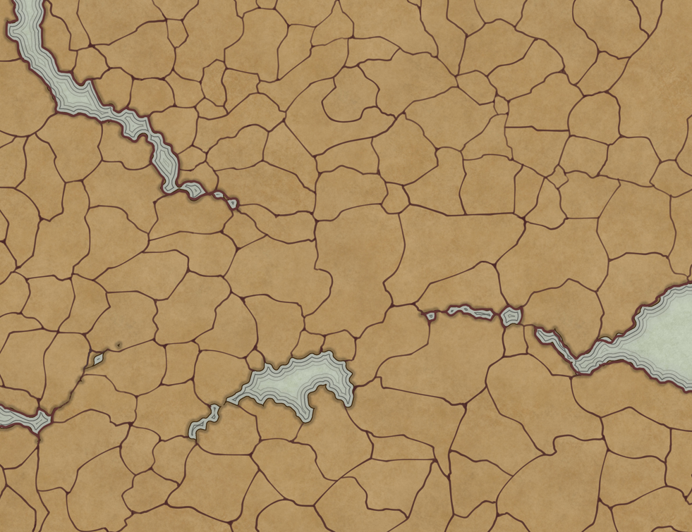
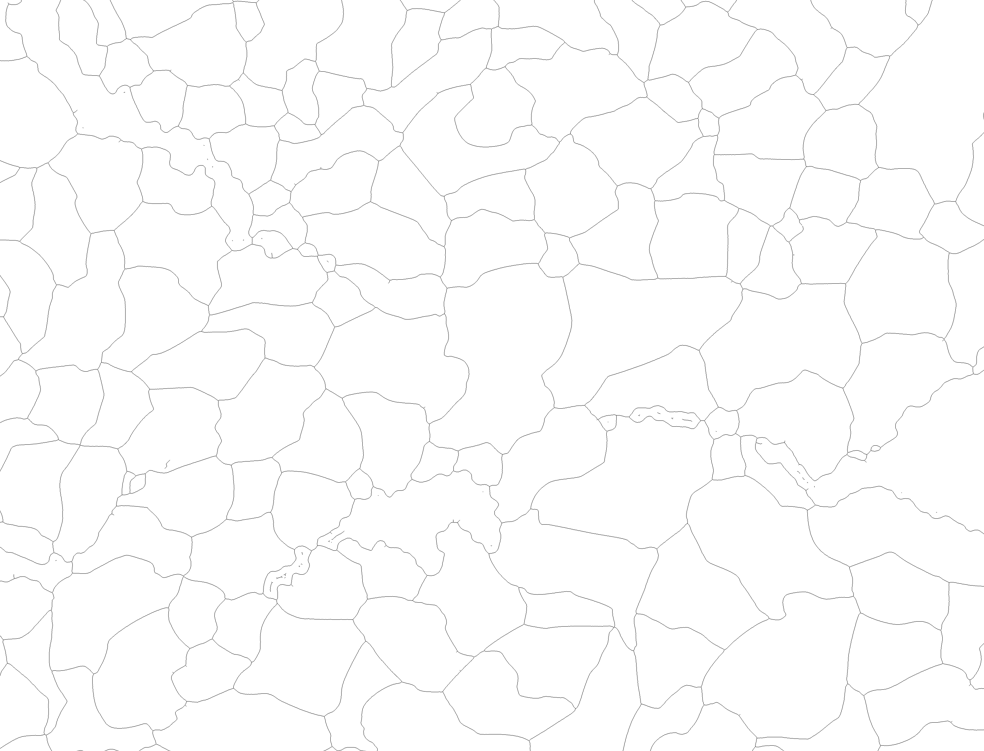
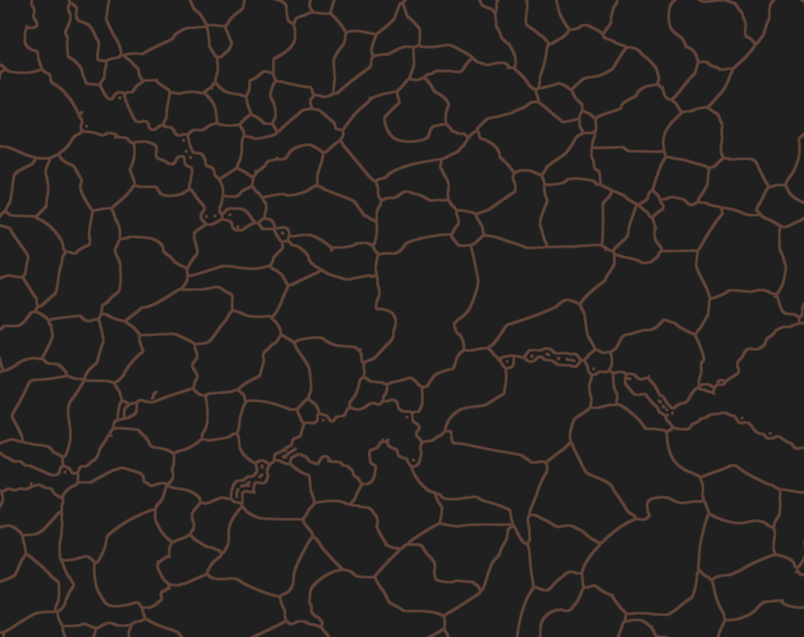
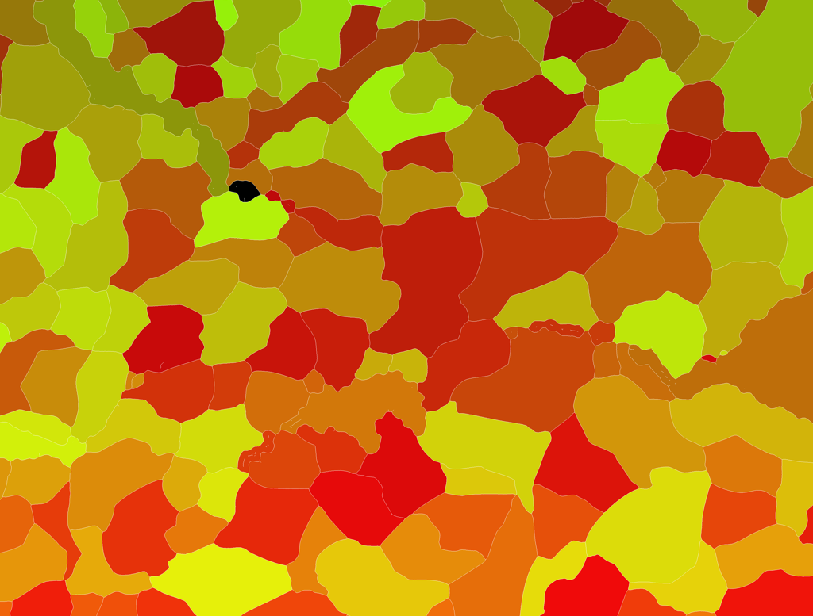

# Phaser Map Engine POC

A map rendering engine built with Phaser.js, featuring advanced WebGL shaders and interactive province selection.

## 🚀 Live Demo

**[Try it live →](https://selimjb.github.io/phaser-map-poc/)**

## 🎨 Asset Generation Pipeline

Using OpenCV to produce optimized assets for WebGL shaders.

`./scripts/` contains a set of notebooks and image operations to produce shader assets. The process is different for each image. `map_assets_preprocessing.ipynb` is a template that can be used as a basis for asset generation.

More details on the processes here: [shader-image-map-playground](https://github.com/SelimJB/shader-image-map-playground)

### Example: From Simple Border to Interactive Map

**Using only this simple border image:**

**You can obtain this interactive map:**

**By generating these assets with OpenCV:**

**We can create many different interactive map styles:**  

## ✨ Features

- Interactive province selection with hover effects
- Real-time WebGL shader rendering with 50+ configurable uniforms
- Multi-map support (Europa, World, Simple)
- Smart color quantization algorithm for province identification
- Automated asset preprocessing with Python/OpenCV
- React + Phaser integration
- Advanced visual effects (glow, contours, pulsations)

## 🛠️ Tech Stack

- **Frontend**: React 18, TypeScript, Phaser 3.80
- **Rendering**: WebGL, Custom Fragment Shaders
- **Preprocessing**: Python, OpenCV, NumPy
- **Build**: Vite, ESLint, Prettier

