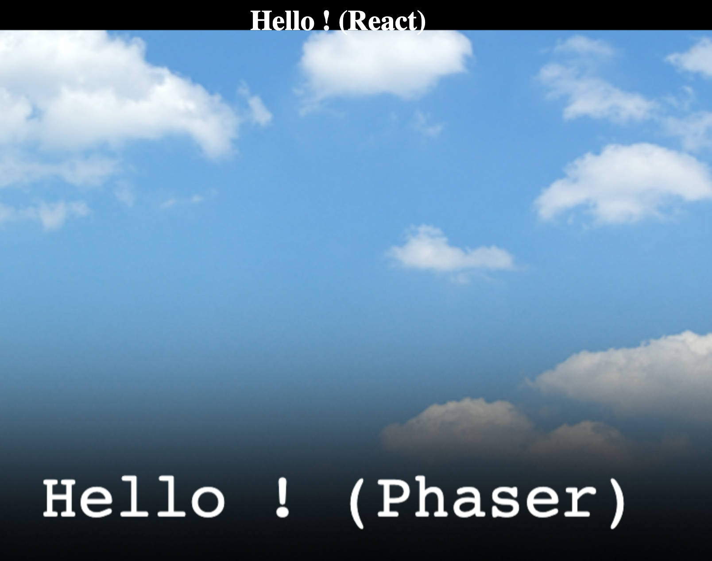

# React-Phaser Boilerplate

A boilerplate for combining the Phaser game engine with React for UI rendering.

This setup lets you use Phaser for game logic and canvas rendering, while React handles menus, overlays, or other UI components.

Feel free to use and modify this boilerplate as you wish.
